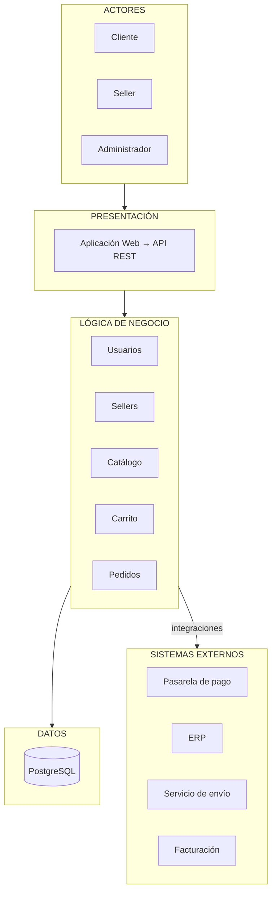

# Arquitectura inicial del sistema (Guía 02)

Primera propuesta en tres capas. Las integraciones con sistemas externos las realiza la capa de lógica de negocio.

## Descripción
- **Presentación:** interacción de los usuarios mediante la aplicación web y la API REST.
- **Lógica de negocio:** módulos de usuarios, sellers, catálogo, carrito y pedidos.
- **Datos:** almacenamiento y consulta en PostgreSQL.
- Los módulos de **Pedidos** y **Catálogo** se integran con la pasarela de pago, el servicio de envío, la facturación y el ERP.
