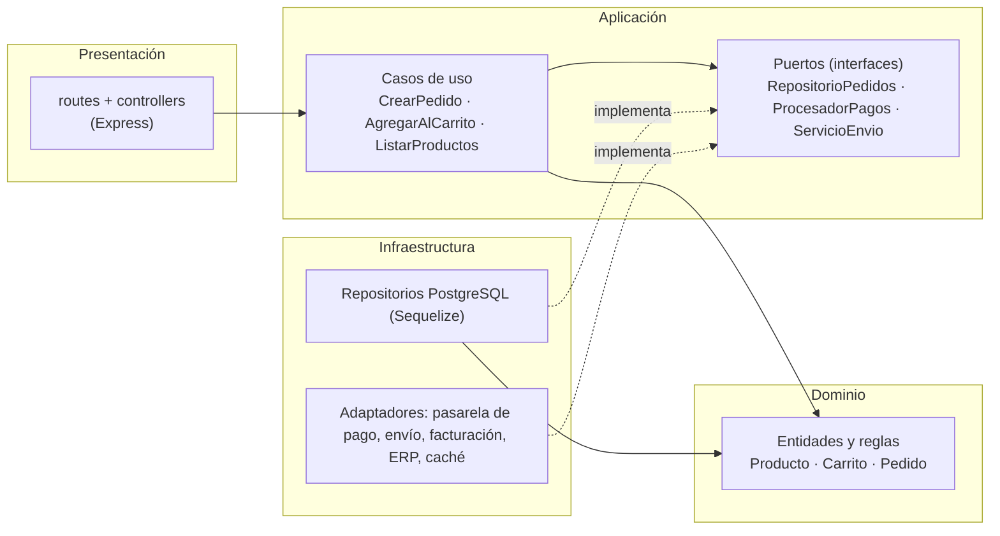

# Enfoque arquitectónico: Clean Architecture

| Elemento | Descripción aplicada al Marketplace |
|---|---|
| Patrón / enfoque | Clean Architecture (Arquitectura Limpia). |
| Objetivo | Separar responsabilidades y controlar las dependencias hacia el dominio. |
| ¿Qué problema resuelve? | Evita el acoplamiento entre la interfaz (Angular), las reglas del negocio y las tecnologías externas (base de datos, API, servicios de pago). |
| Capas | Presentación, Aplicación, Dominio e Infraestructura. |
| Beneficios | Facilita mantenimiento y pruebas unitarias; permite cambiar implementaciones técnicas sin tocar el negocio; mejora la separación de responsabilidades. |

## Regla de dependencia
Las dependencias del código apuntan **hacia el interior**: el dominio no importa nada de las capas externas.



## Capas y ejemplos de GoPet
| Carpeta | Capa | ¿Qué contiene? | Ejemplos |
|---|---|---|---|
| `domain/` | Dominio | Entidades, objetos de valor y reglas de negocio. Sin dependencias externas. | `Producto`, `Carrito`, `Pedido`, `Dinero` |
| `application/` | Aplicación | Casos de uso, puertos (interfaces) y DTO. | `AgregarAlCarrito`, `ListarProductos`, `CrearPedido`, `PagarPedido`, `RepositorioPedidos`, `ProcesadorPagos` |
| `presentation/` | Presentación | Rutas, controladores y validación de entrada HTTP. | `pedidos.routes.js`, `PedidoController` |
| `infrastructure/` | Infraestructura | Implementaciones concretas de los puertos. | `PedidoRepositoryPg`, `PasarelaPagosAdapter`, `EnvioAdapter`, `ErpAdapter`, `CacheRedisAdapter` |

## Reglas de negocio (dominio)
- Un pedido debe tener al menos un producto.
- El total del pedido debe ser mayor que 0.
- Un producto debe tener stock suficiente para agregarse al pedido.
- Un pedido cancelado no puede confirmarse.

## Estructura de carpetas (por módulo)
```
src/
├── modules/
│   ├── pedidos/
│   │   ├── domain/            # Pedido.js, ItemPedido.js, reglas
│   │   ├── application/
│   │   │   ├── use-cases/     # CrearPedido.js, PagarPedido.js, ConsultarPedidos.js
│   │   │   ├── ports/         # RepositorioPedidos.js, ProcesadorPagos.js
│   │   │   └── dto/
│   │   ├── presentation/      # pedidos.routes.js, pedidos.controller.js
│   │   └── infrastructure/    # pedido.repository.pg.js, pasarela-pagos.adapter.js
│   ├── catalogo/  carrito/  sellers/  usuarios/   # misma estructura
├── shared/                    # config, middlewares (JWT, errores), conexión BD
└── app.js                     # raíz de composición: conecta puertos con adaptadores
```

## Flujo de ejemplo: crear un pedido
1. `POST /api/v1/pedidos` llega al **controlador** (Presentación), que valida y arma el DTO.
2. El controlador invoca el caso de uso **CrearPedido** (Aplicación).
3. El caso de uso carga el carrito, crea la entidad **Pedido** y aplica sus reglas (Dominio).
4. Guarda mediante el puerto `RepositorioPedidos`, que implementa `PedidoRepositoryPg` (Infraestructura).
5. `PagarPedido` usa el puerto `ProcesadorPagos`, que implementa el adaptador de la pasarela.
6. La respuesta JSON vuelve por el controlador.

## Aplicación a los drivers
| Driver | Cómo lo atiende Clean Architecture |
|---|---|
| DA06 Mantenibilidad | Un cambio en una capa externa no obliga a modificar el dominio. |
| DA04 Pago externo | Puerto `ProcesadorPagos` + adaptador intercambiable. |
| DA02 Rendimiento | La caché se añade como adaptador sin tocar los casos de uso. |
| DA03 Seguridad | Autenticación y autorización en Presentación; el dominio no depende de ellas. |

## Frontend
El frontend Angular puede aplicar la misma idea (componentes → casos de uso → modelos y contratos, con adaptadores HTTP). Este documento se centra en el backend.
