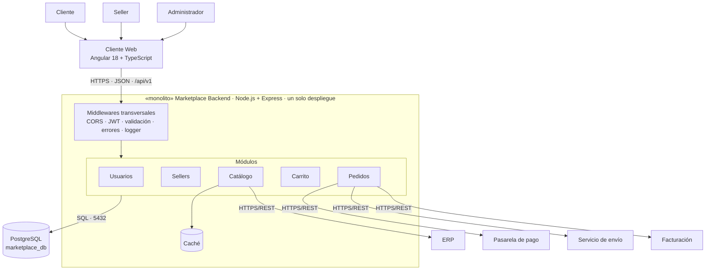

# Estilo arquitectónico

## Estilo seleccionado
**Monolito modular** con organización **cliente-servidor** y **en capas**, comunicado por **API REST**.

| Aspecto | Decisión |
|---|---|
| Despliegue | Una sola aplicación backend (un proceso Node.js), escalable horizontalmente con varias instancias. |
| Organización | Módulos por dominio: usuarios, sellers, catálogo, carrito y pedidos. |
| Cliente | Aplicación web Angular que consume la API REST. |
| Datos | Una base PostgreSQL; cada módulo es dueño de sus tablas. |
| Externos | Pasarela de pago, servicio de envío, facturación y ERP, consumidos mediante adaptadores. |

> Capas = organización lógica; monolito = unidad de despliegue. Ambas conviven.

## Justificación
- **DA01 Escalabilidad:** se replican instancias del monolito detrás de un balanceador.
- **DA06 Mantenibilidad:** los módulos aíslan los cambios.
- **DA05 / RC03:** el cliente-servidor con REST separa interfaz y backend.
- Los microservicios se descartan por ahora: el alcance y el tamaño del equipo no justifican su complejidad. Los módulos permiten extraerlos después si hace falta.

## Diagrama

## Reglas del estilo
1. Cada módulo es un límite (`src/modules/<modulo>`).
2. Un módulo no accede a las tablas de otro; usa su caso de uso.
3. Todo se ejecuta en un único proceso Node.js con una única base de datos.
4. Los sistemas externos están fuera del monolito y se acceden por adaptadores.
